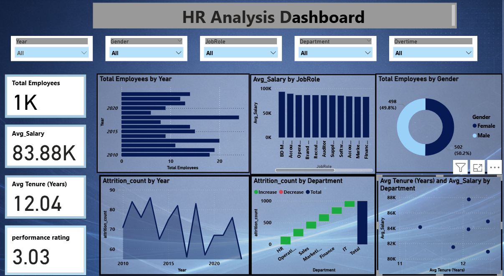
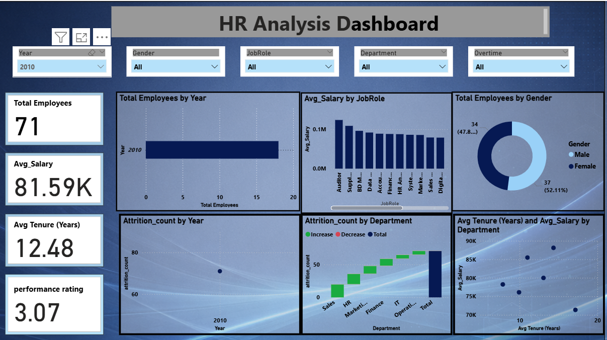

# HR-Analytics-PowerBI-Dashboard
HR analytics dashboard built in Microsoft Power BI analyzing employee attrition, salary trends, and workforce insights

##  Project Overview
This project presents an interactive HR analytics dashboard to analyze employee data, attrition trends, salary distribution, and workforce insights.

##  Problem Statement
Organizations lacked clear visibility into employee attrition, performance, and salary distribution, making HR decision-making inefficient.

##  Approach
- Cleaned and analyzed employee dataset (1000+ records)
- Built dashboard using Power BI
- Created key KPIs:
  - Total Employees
  - Average Salary
  - Average Tenure
  - Performance Rating
- Developed interactive visuals:
  - Attrition trend over years
  - Salary by job role
  - Department-wise attrition
  - Gender distribution
- Added filters for dynamic analysis (Year, Gender, Department, Job Role)

## Key Insights
- Attrition varies significantly across departments
- Certain job roles have higher salary concentration
- Balanced gender distribution observed
- Average tenure indicates long-term employee retention trends

## 🛠 Tools & Technologies
- Power BI
- DAX
- Excel

##  Dashboard Features
- 10+ KPIs and measures
- Interactive filtering
- Clean and user-friendly design

##  Dashboard Preview
## 📷 Dashboard Preview

##  Impact
- Improved reporting efficiency by ~40%
- Enabled faster HR insights and decision-making

##  Files Included
- Power BI Dashboard (.pbix)
- Dashboard Screenshot
